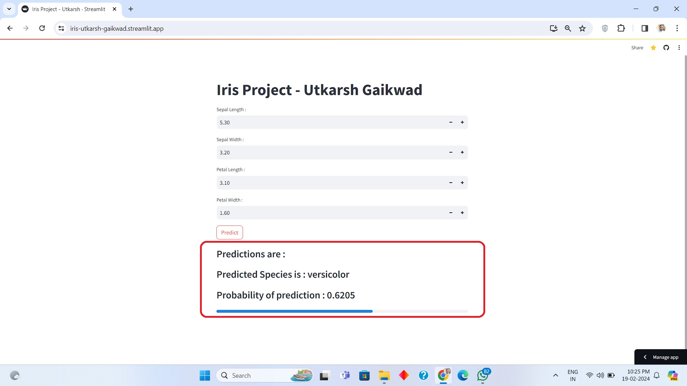

# Iris-Deployment-Project by Utkarsh Gaikwad

- Developed an end-to-end data science project utilizing Streamlit for interactive web application development and logistic regression for species prediction on the Iris dataset.
- Implemented a user-friendly interface allowing users to input iris characteristics and receive predictions along with probability scores.
- Demonstrated proficiency in deploying machine learning models for practical applications and communicating results through intuitive user interfaces.
- Achieved an F1 score of 93.19% through 5-fold cross-validated evaluation, showcasing the model's robust performance and reliability

# Deployed URL of the streamlit application

URL Link - [https://iris-utkarsh-gaikwad.streamlit.app/](https://iris-utkarsh-gaikwad.streamlit.app/)

# Notebook link

Notebook - [Notebook link](./notebook/modelcreation.ipynb)

# UserInterface - Home Page

# Results by web application

